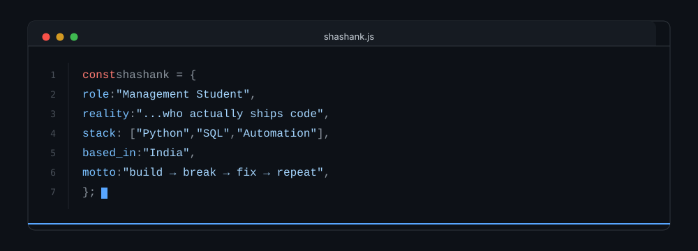

<div align="center">



<br/>

[](https://git.io/typing-svg)

<h1>Hey, I'm Shashank 🇮🇳</h1>
<h3>The rare management student who actually pushes code.</h3>

</div>

### 👀 Quick facts

|  |  |
|---|---|
| 🎓 **Studying** | Management — with a side quest in software |
| 💻 **Building with** | Python, SQL, and a lot of automation scripts |
| 🌙 **Working hours** | Mostly after midnight, ask my sleep schedule |
| 🎯 **Currently** | In-active on socials, active in the terminal |
| 📫 **Reach me** | [Telegram](https://t.me/maybeshashank) · [GitHub](https://github.com/theshashankk/) |

### 🛠️ Tech Stack

<div align="center">

</div>

### ⚡ Try it in your Terminal

```bash
npx theshashank
```

<p align="center"><sub>a little CLI experiment — <a href="https://www.npmjs.com/package/theshashank">view on npm</a></sub></p>

### 📊 GitHub Stats

<div align="center">


</div>

<details>
<summary>🏆 Trophy case</summary>
<br>
<div align="center">

</div>
</details>

### 🐍 Contribution Snake

<details>
<summary>🐍 View animated graph</summary>
<br>
<div align="center">
<picture>
  <source media="(prefers-color-scheme: dark)" srcset="https://raw.githubusercontent.com/theshashankk/theshashankk/output/assets/snake-dark.svg" />
  
</picture>
</div>
</details>

### 🦉 Coding Clock

<!--START_SECTION:owl-->
```text
🌞 Morning    267 commits     ███████░░░░░░░░░░░░░░░░░░   26.70%
🌆 Daytime    284 commits     ███████░░░░░░░░░░░░░░░░░░   28.40%
🌃 Evening    387 commits     ██████████░░░░░░░░░░░░░░░   38.70%
🌙 Night       62 commits     ██░░░░░░░░░░░░░░░░░░░░░░░   6.20%
```
<!--END_SECTION:owl-->


### 🔗 Connect

<div align="center">

| | | | |
|:---:|:---:|:---:|:---:|
| [](https://t.me/maybeshashank) | [](https://github.com/theshashankk/) | [](https://instagram.com/shashankbhardwaj_21) | [](mailto:shashannxd@gmail.com) |

</div>

<div align="center">


<br/>


<sub>Made with ❤️ by Shashank © 2025</sub>

</div>
