<a href="https://ibb.co/x661ksC"></a>
<a href="https://ibb.co/GC9JRyn"></a>
<a href="https://ibb.co/f4Qmw94"></a>

## Terminal 
<table>
  <td align="center">
    
    
  </td>
</table>

## About me.

```yml
{
  'name': 'Shashank Sharma',
  'country': 'India',
  'language': 'Hindi', 'English",
  'programming_languages': 'Python', 'Bash', 'Html',
  'developer_tools': 'Github', 'bootstrap', 'Stack Overflow', 'Heroku', 'Digital ocean', 'railway', 'Mongodb',
  'operating_system': 'Windows', 'Android',
  'windows os': 'Windows 10', 'Windows 11'
}
```

<a href="theshashank.me"></a>

<p align="center"></p>

<a href="theshashank.me"></a>
